# Como criar uma nova página

!!! warning "Código de Conduta"
    Antes de começar, é importante ler o nosso
    [Código de Conduta](https://github.com/cumbucadev/contributions/blob/main/CODE_OF_CONDUCT.md)
    para entender as diretrizes de comportamento e colaboração dentro da comunidade.

Este guia explica, passo a passo, como criar uma nova página na Cumbuca Docs usando apenas o navegador e o GitHub. Não é necessário saber programar ou instalar ferramentas. Todo o processo pode ser feito diretamente pela interface do GitHub.

A documentação da comunidade fica neste site:
[cumbucadev/comunidade](https://github.com/cumbucadev/comunidade), também conhecido como
`repositório da comunidade`.

Criar uma nova página significa adicionar um novo arquivo de documentação dentro da pasta `docs`.

## Antes de começar

Para editar a documentação, você precisa de:

* Uma conta no GitHub
* Estar logada na sua conta
* Acessar o [repositório da comunidade](https://github.com/cumbucadev/comunidade)
* Ter acesso de escrita no [repositório da comunidade](https://github.com/cumbucadev/comunidade)

Antes de criar uma nova página, verifique se:

* A informação realmente precisa de uma nova página
* O conteúdo não já existe em outra parte da documentação
* Você sabe em qual seção da Docs a nova página deve ficar

## Passo 1: acessar o repositório

* Abra o repositório da comunidade: <https://github.com/cumbucadev/comunidade>.
* Dentro dele estão vários arquivos e pastas. Toda a documentação fica dentro da pasta **docs**.
* Clique na pasta **docs** para visualizar as páginas da documentação.

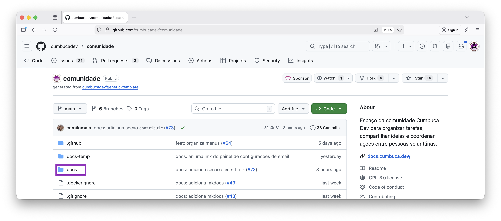

## Passo 2: navegar até a seção correta

Dentro da pasta `docs`, navegue pelas pastas até encontrar o local onde a nova página deve ficar.

Por exemplo:

```txt
docs → cumbuca-docs → contribuir
```

Cada pasta representa uma seção da documentação. Escolha a pasta que melhor representa o tema da
nova página.

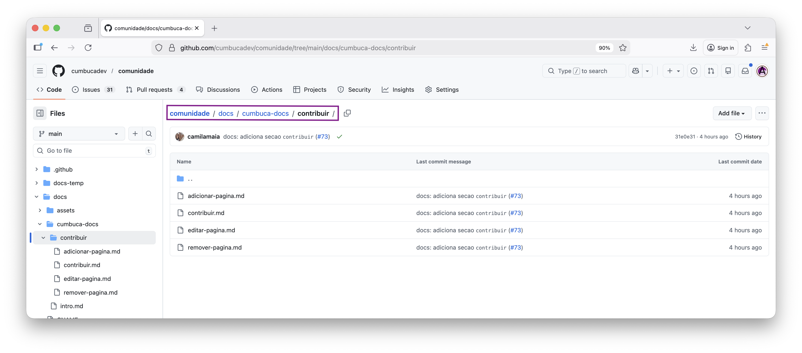

## Passo 3: criar um novo arquivo

* Depois de entrar na pasta correta, procure o botão **Add file**
* Clique em **Add file**
* Selecione **Create new file**

Isso abrirá o editor para criar um novo arquivo.

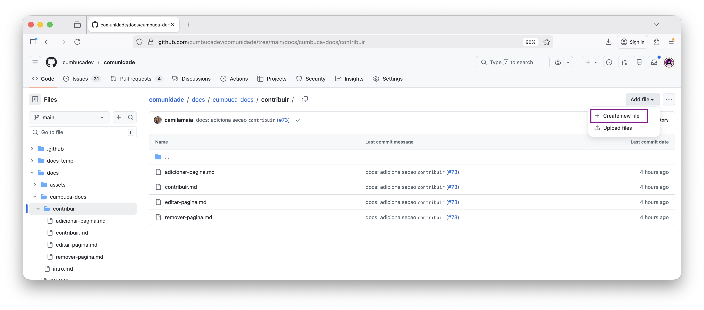

## Passo 4: definir o nome do arquivo

No topo do editor, você precisará definir o nome do novo arquivo.

O nome deve terminar com `.md`, que é o formato usado pela documentação.

Exemplos:

```sh
como-contribuir.md
guia-de-eventos.md
processo-de-onboarding.md
```

Algumas boas práticas para nomes de arquivos:

* usar letras minúsculas
* usar hífen `-` para separar palavras
* evitar espaços
* escolher nomes curtos e descritivos
* evitar acentos e caracteres especiais

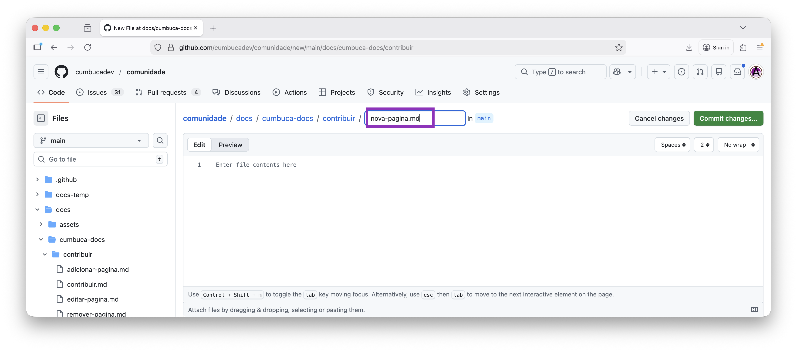

## Passo 5: escrever o conteúdo da página

Depois de definir o nome do arquivo, você pode começar a escrever o conteúdo da página.

A documentação usa **Markdown**, um formato simples para textos estruturados.

Exemplo de estrutura básica de uma página:

```sh
# Título da página

Breve introdução explicando o objetivo da página.

## Seção

Conteúdo da seção.

## Outra seção

Mais conteúdo.
```

Algumas convenções comuns:

* `#` indica o título da página
* `##` indica subtítulos
* Parágrafos são separados por uma linha em branco
* Links usam o formato `[texto](link)`

Caso você queira fazer algo que não está descrito neste guia, como adicionar **imagens**, pode consultar este guia de Markdown <https://www.markdownguide.org/basic-syntax/>.

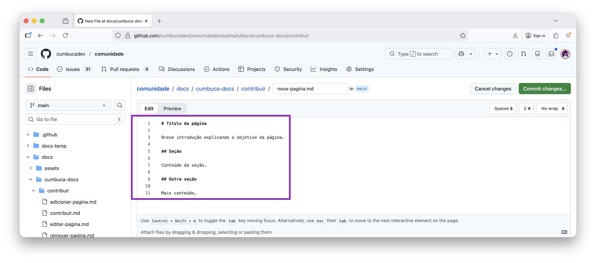

Se quiser visualizar como o conteúdo ficará, use a aba **Preview** no topo do editor.

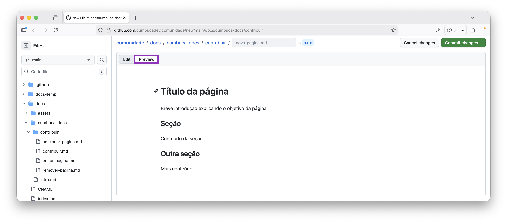

## Passo 6: salvar a nova página

Depois de terminar o conteúdo da página, clique no botão **Commit changes**, que fica no topo da página.

Isso abrirá a janela para registrar a alteração.

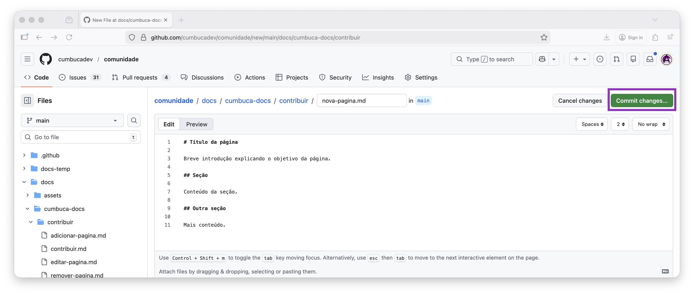

## Passo 7: escrever a mensagem do commit

Na Cumbuca, seguimos uma convenção simples para commits de documentação: a mensagem deve começar com `docs:`.

Isso ajuda a identificar facilmente mudanças relacionadas à documentação.

Exemplos:

```sh
docs: cria página sobre organização de eventos
docs: adiciona guia de onboarding da comunidade
docs: cria documentação sobre processos internos
```

Depois de `docs:`, escreva uma frase curta explicando o que foi criado.

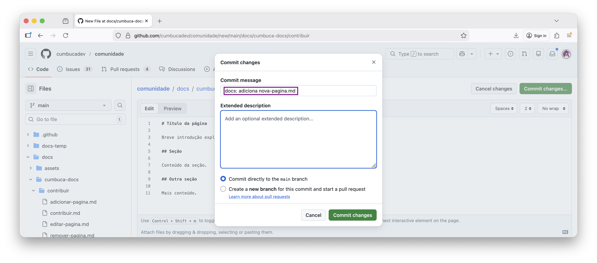

## Passo 8: criar um branch para a alteração

* Ao registrar o commit, selecione a opção: **Create a new branch for this commit and start a pull request**
* Isso criará um **branch separado** para a nova página.

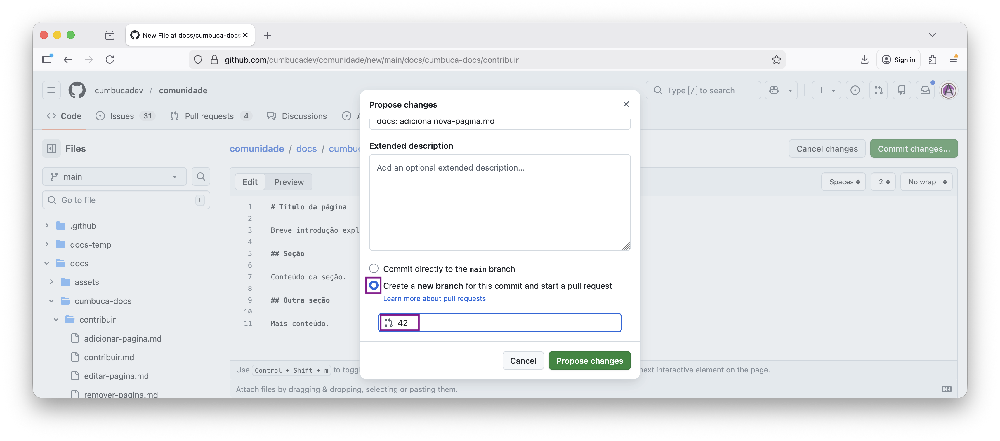

* Depois clique em **Propose changes**.

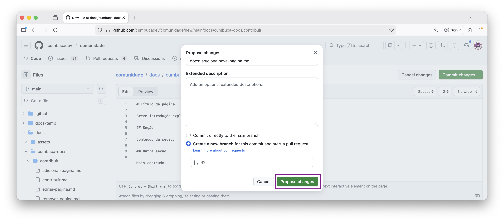

## Passo 9: abrir o Pull Request

* Depois do commit, o GitHub abrirá automaticamente a página para criar um **Pull Request**.
* Um Pull Request é uma proposta de alteração no repositório.
* Na descrição do Pull Request, adicione `Closes #<numero-da-issue>` para indicar qual issue está sendo resolvida.

Exemplo:

```md
closes #42
```

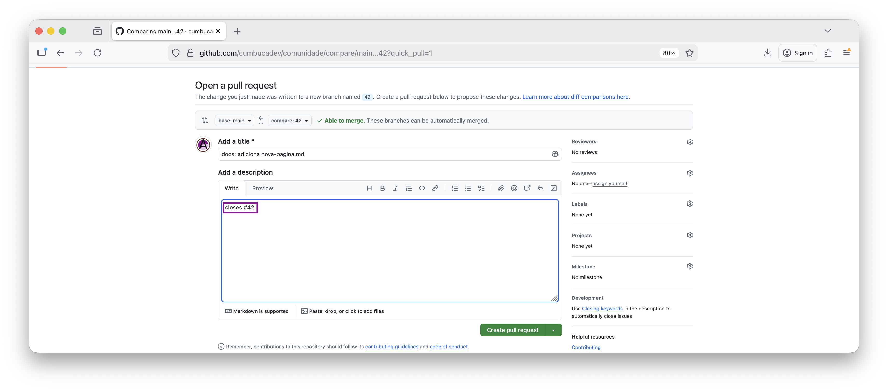

Isso faz com que a issue seja **fechada automaticamente** quando o Pull Request for aprovado e integrado ao repositório.

* Revise as mudanças e clique em **Create pull request**.

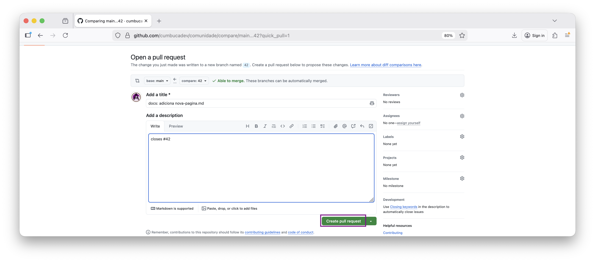

* Depois de clicar em Create pull request, o Pull Request será criado no repositório da comunidade.

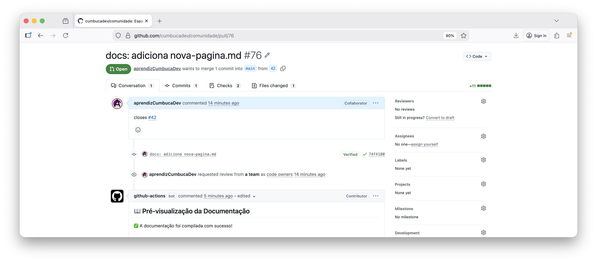

* Se você descer a página do Pull Request, verá um comentário automático com um link para pré-visualizar as mudanças na documentação.

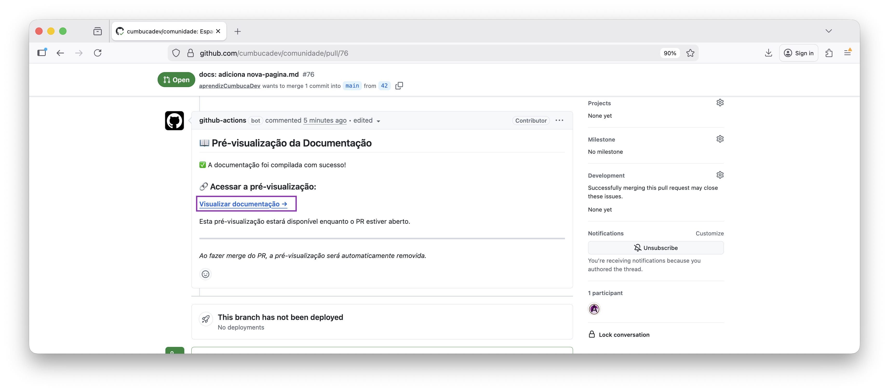

_Caso esse comentário ainda não tenha aparecido ou o link retorne 404, aguarde alguns minutos e atualize a página. O deploy de preview pode levar um pequeno tempo para ser gerado._

## Passo 10: adicionar a página ao menu da documentação

Para que a nova página apareça no menu da Cumbuca Docs, é necessário adicioná-la ao arquivo `mkdocs.yml`.

Esse arquivo define a estrutura de navegação da documentação.

### 1. Trocar para o branch do Pull Request

Antes de editar qualquer arquivo, verifique se você está no **branch correto**.

No topo da página do repositório existe um **seletor de branch**.

* Clique no seletor de branch
* Escolha o **branch criado pelo seu Pull Request**

Isso garante que a alteração será adicionada ao mesmo PR.

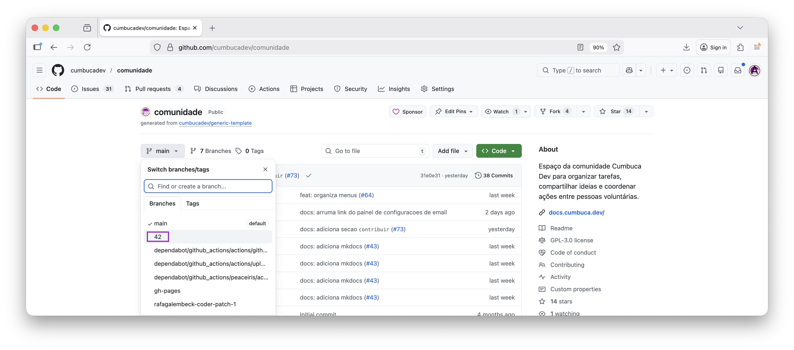

### 2. Abrir o arquivo mkdocs.yml

Depois de selecionar o branch correto:

* Procure o arquivo **mkdocs.yml** na raiz do repositório

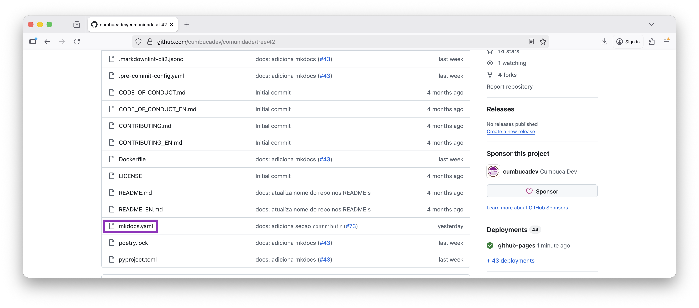

* Clique no arquivo para abrir

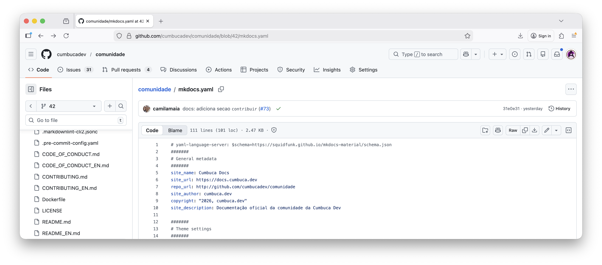

* Clique no **ícone de lápis** para editar


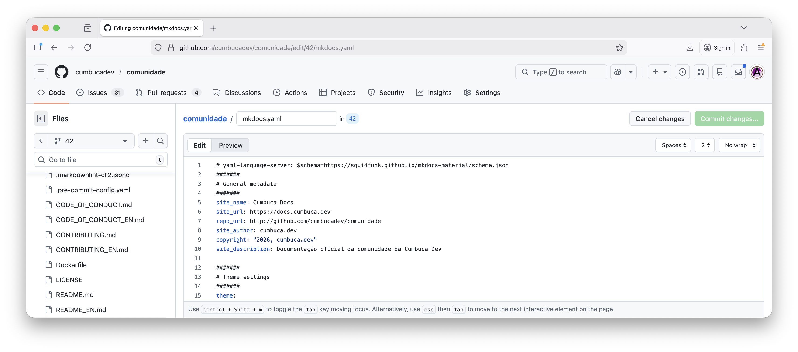

### 3. Encontrar a seção `nav`

Dentro do arquivo, procure a seção chamada `nav`.
Ela define quais páginas aparecem no menu da documentação.

Exemplo simplificado:

```yml
nav:
  - Cumbuca Docs:
    - cumbuca-docs/intro.md
    - Como contribuir:
      - Sei programar: cumbuca-docs/contribuir/contribuir.md
      - NÃO sei programar:
        - cumbuca-docs/contribuir/editar-pagina.md
        - cumbuca-docs/contribuir/adicionar-pagina.md
        - cumbuca-docs/contribuir/remover-pagina.md
```

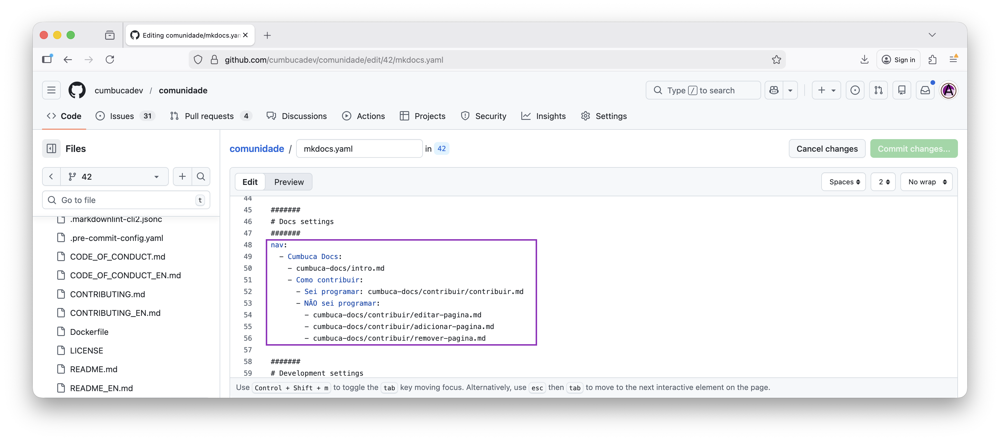

### 4. Adicionar a nova página

Adicione uma nova linha apontando para o arquivo que você criou.

Exemplo:

```yml
nav:
  - Cumbuca Docs:
    - cumbuca-docs/intro.md
    - Como contribuir:
      - Sei programar: cumbuca-docs/contribuir/contribuir.md
      - NÃO sei programar:
        - cumbuca-docs/contribuir/editar-pagina.md
        - cumbuca-docs/contribuir/adicionar-pagina.md
        - cumbuca-docs/contribuir/remover-pagina.md
        - cumbuca-docs/contribuir/nova-pagina.md
```

O texto antes dos dois pontos (`:`) será o nome exibido no menu.
O caminho depois dos dois pontos é o caminho do arquivo dentro da pasta `docs`.

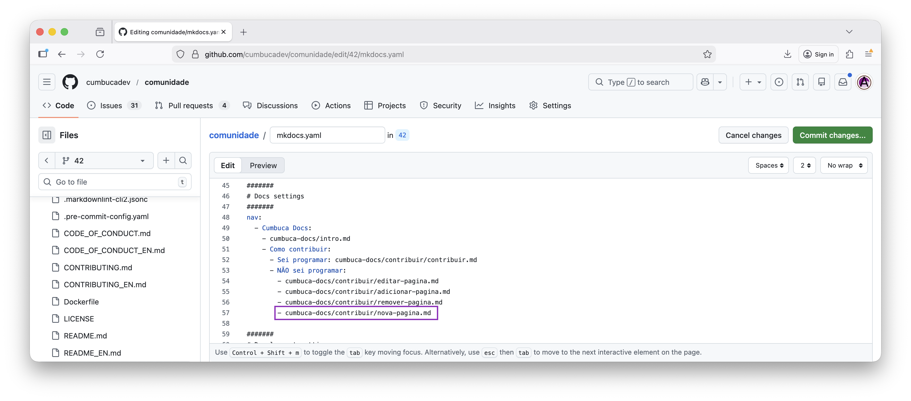

### 5. Salvar a alteração

Depois de editar o arquivo:

* Clique em **Commit changes**

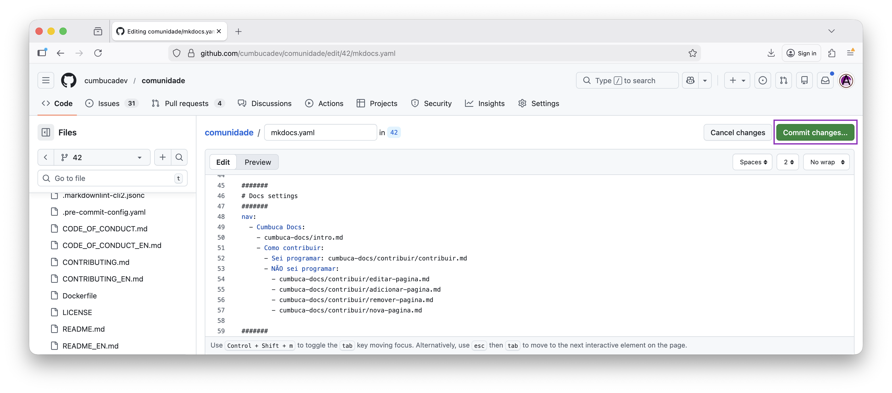

* Use uma mensagem de commit começando com `docs:`

Exemplo:

```sh
docs: adiciona nova página ao menu da documentação
```

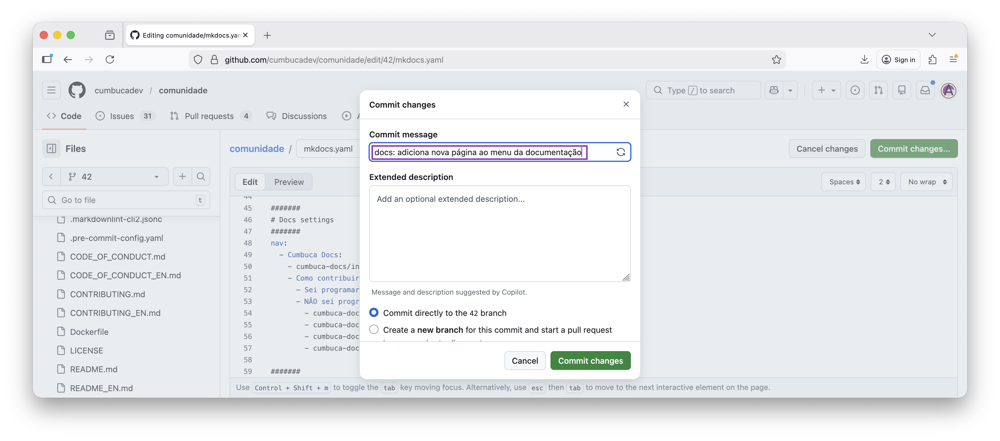

Como você já está no branch correto, o commit será automaticamente adicionado ao **mesmo Pull Request**. Você não precisa alterar nada.

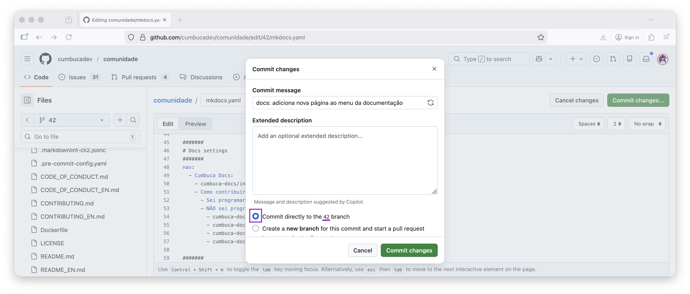

* Depois clique em **Commit changes**.

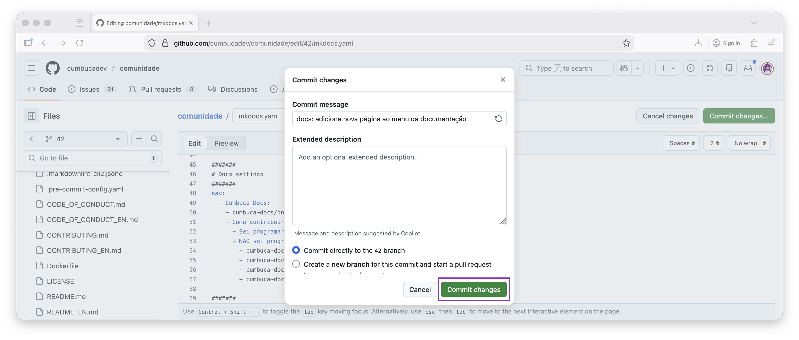

## Passo 11: acompanhar o Pull Request

Depois de adicionar a página ao menu e salvar o commit, o Pull Request continuará aberto até que seja revisado.

Você pode acompanhar o status do Pull Request diretamente no GitHub.

### 1. Acessar a aba Pull requests

No repositório da comunidade, clique na aba **Pull requests** no topo da página.

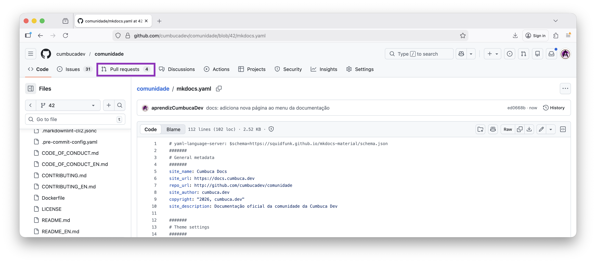

### 2. Encontrar o Pull Request criado

Depois de abrir a aba **Pull requests**, você verá a lista de Pull Requests abertos no repositório.

Procure pelo Pull Request que você criou.

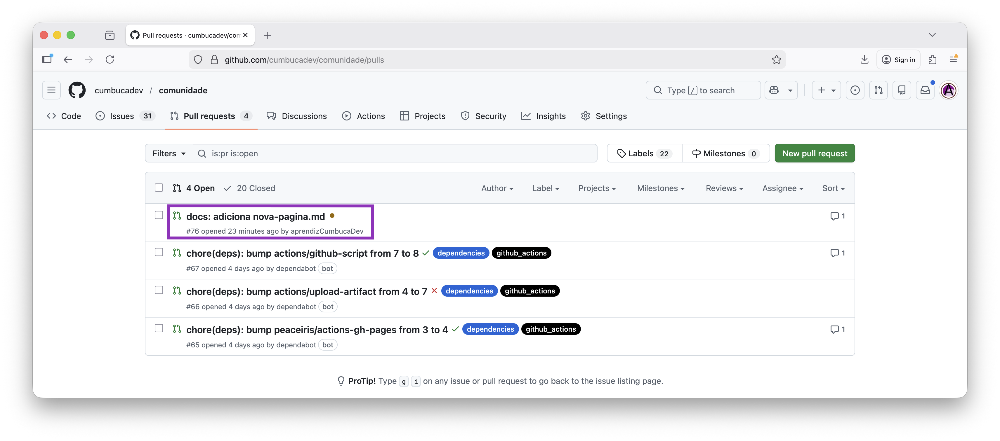

### 3. Abrir o Pull Request

Clique no título do Pull Request para abrir a página com os detalhes da alteração.

Nessa página você poderá ver:

* a descrição do Pull Request
* os commits realizados
* os arquivos modificados

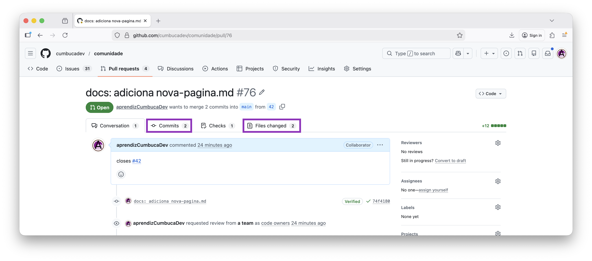

### 4. Nova pré-visualização após atualizar o menu

Depois que você adicionar a nova página ao menu da documentação (no arquivo `mkdocs.yml`) e fizer um novo commit, uma nova pré-visualização será gerada.

Ao descer novamente a página do Pull Request, você verá **um novo comentário abaixo do primeiro**, com um link atualizado para visualizar a documentação.

Esse novo link mostrará a documentação já com **a navegação (menu) atualizada**.

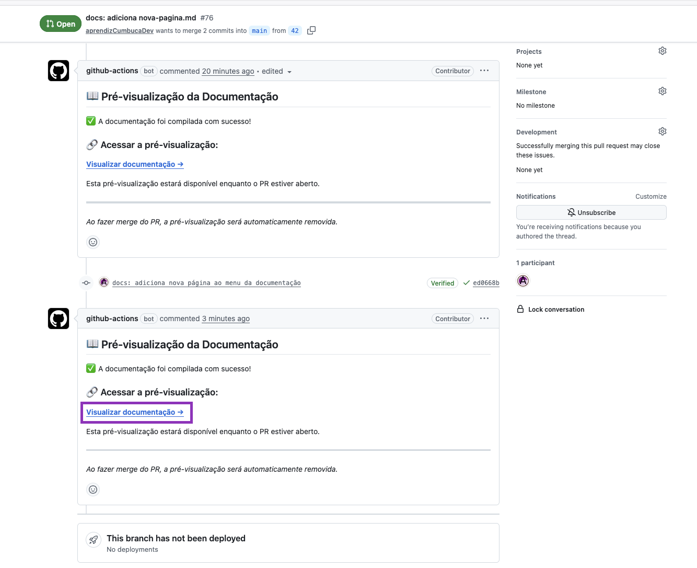

### 5. Aguardar a revisão

Depois que o Pull Request estiver pronto, alguém da comunidade irá revisar a alteração.

Durante esse processo podem acontecer algumas situações:

* a alteração é aprovada
* são sugeridas melhorias
* são solicitados ajustes

## Passo 12: integração do Pull Request

Quando todas as verificações estiverem corretas e a revisão for concluída, o Pull Request poderá ser integrado ao repositório.

Isso acontece através do botão **Squash and merge**.

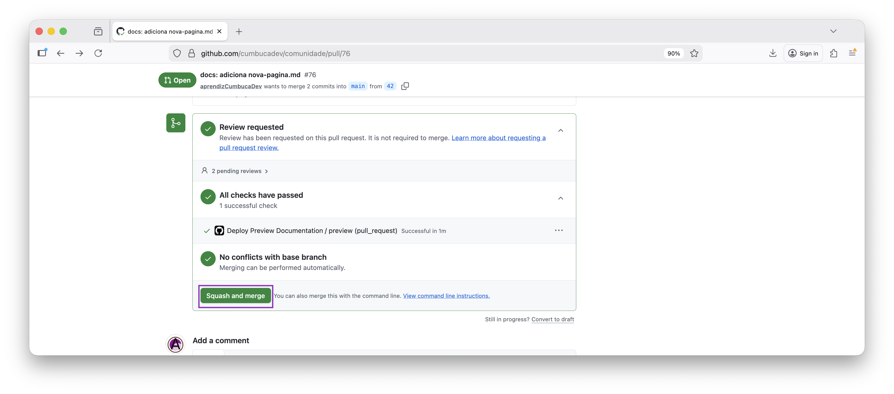

## Dicas para criar boas páginas

* Comece com um título claro
* Explique o objetivo da página logo no início
* Use seções para organizar o conteúdo
* Prefira textos simples e diretos
* Evite páginas muito longas

Boa documentação é clara, organizada e fácil de manter.
