# Como editar uma página

!!! warning "Código de Conduta"
    Antes de começar, é importante ler o nosso
    [Código de Conduta](https://github.com/cumbucadev/contributions/blob/main/CODE_OF_CONDUCT.md)
    para entender as diretrizes de comportamento e colaboração dentro da comunidade.

Este guia explica, passo a passo, como editar uma página da Cumbuca Docs usando apenas o navegador e o GitHub. Não é necessário saber programar, instalar ferramentas ou usar terminal. Todo o processo pode ser feito diretamente pela interface do GitHub.

A documentação da comunidade fica neste repositório:
[cumbucadev/comunidade](https://github.com/cumbucadev/comunidade)

Quando você faz uma alteração, ela não modifica o site imediatamente. Primeiro, a mudança fica registrada no repositório e depois é publicada automaticamente pela infraestrutura da documentação.

## Antes de começar

Para editar a documentação, você precisa apenas de:

* Uma conta no GitHub
* Estar logada na sua conta
* Acessar o [repositório da comunidade](https://github.com/cumbucadev/comunidade)
* Ter acesso de escrita no [repositório da comunidade](https://github.com/cumbucadev/comunidade)

Todo o restante do processo acontece diretamente pelo navegador.

## Passo 1: acessar o repositório

Abra o repositório da comunidade: [cumbucadev/comunidade](https://github.com/cumbucadev/comunidade)

Dentro dele estão vários arquivos e pastas. A documentação da Cumbuca fica dentro da pasta chamada **docs**.

Clique nessa pasta para visualizar as páginas da documentação.

Cada página corresponde a um arquivo com final `.md`. Esse é o formato usado para escrever documentação.


## Passo 2: encontrar a página que você quer editar

Dentro da pasta **docs**, navegue pelas pastas até encontrar a página que deseja alterar. Por
exemplo:

```txt
docs → cumbuca-docs → contribuir
```

Clique no nome do arquivo para abrir o conteúdo da página.

Nesse momento você estará vendo o arquivo em modo de leitura.

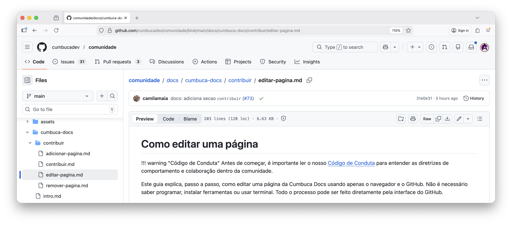

## Passo 3: abrir o modo de edição

No canto superior direito da página do arquivo existe um **ícone de lápis**. Esse ícone abre o editor.

Clique no lápis para começar a editar o arquivo.

Depois disso o GitHub abrirá o **editor online**, onde você poderá alterar o texto da página.

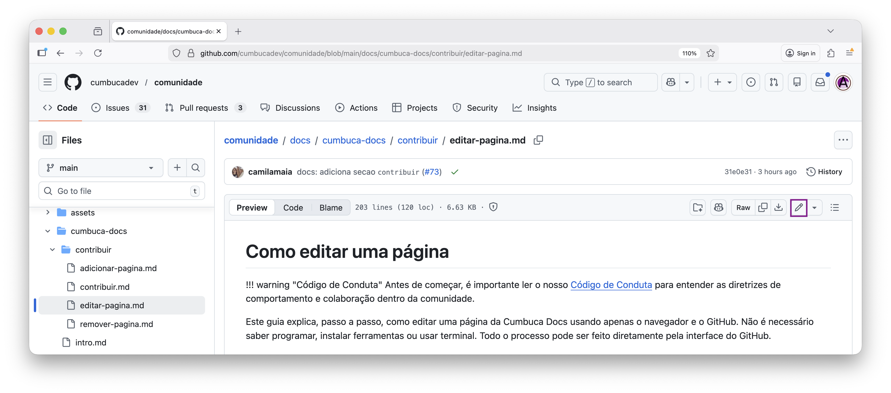

## Passo 4: editar o conteúdo da página

Agora você pode modificar o texto da documentação.

O editor funciona como um editor de texto simples. Você pode:

* Corrigir erros de digitação
* Atualizar informações
* Adicionar novos parágrafos
* Melhorar explicações

A documentação é escrita em **Markdown**, um formato simples para textos estruturados.

Algumas convenções comuns:

* `#` indica um título
* `##` indica um subtítulo
* Parágrafos são separados por uma linha em branco
* Links usam o formato `[texto](link)`

Mesmo sem conhecer Markdown profundamente, a maioria das edições é bastante intuitiva.

Caso você queira fazer algo que não está descrito neste guia, como adicionar **imagens**, pode consultar este guia de Markdown <https://www.markdownguide.org/basic-syntax/>.

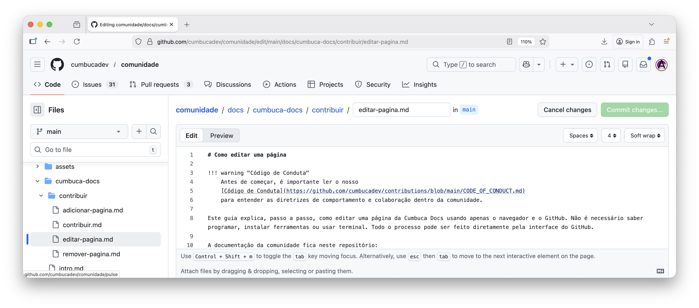

Se quiser ver como o texto ficará depois de publicado, use a aba **Preview** no topo do editor.

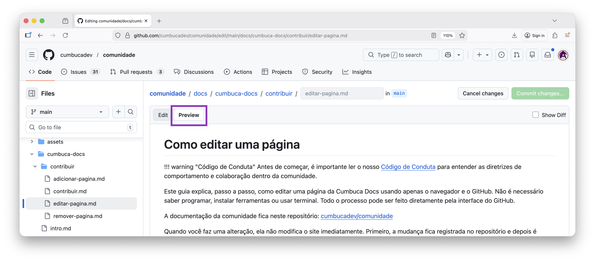

## Passo 5: salvar suas alterações

Depois de terminar suas alterações, você precisa registrar a mudança.

Diferente de outros editores, no GitHub o botão para salvar fica **no topo da página**, chamado **Commit changes**.

Clique em **Commit changes**.

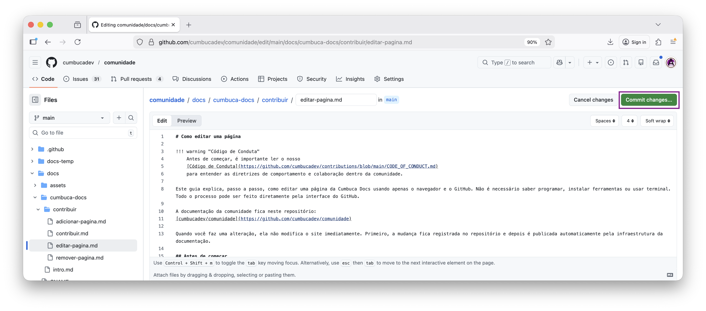

## Passo 6: descrever o que foi alterado

Após clicar em **Commit changes**, uma janela será aberta para registrar a alteração.

O primeiro campo é um resumo curto do que foi modificado.

Na Cumbuca, seguimos uma convenção simples para commits de documentação: a mensagem deve começar com `docs:`.

Isso ajuda a identificar facilmente mudanças relacionadas à documentação.

Exemplos:

* docs: corrige erro de digitação no código de conduta
* docs: atualiza descrição do núcleo de eventos
* docs: melhora explicação sobre como contribuir

Depois de `docs:`, escreva uma frase curta explicando o que mudou.

Esse texto ajuda outras pessoas a entenderem rapidamente a alteração feita.

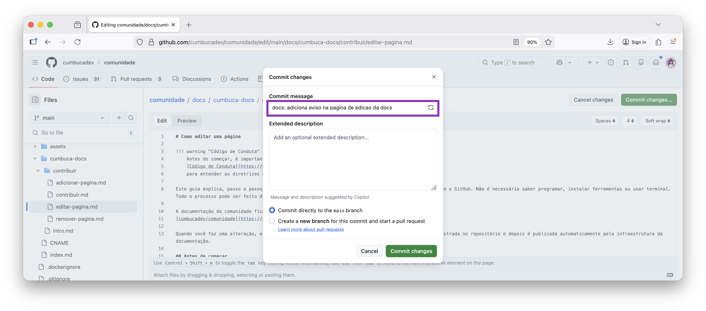

## Passo 7: confirmar o commit

* Ao registrar o commit, selecione a opção: **Create a new branch for this commit and start a pull request**
* Isso criará um **branch separado** para a nova página.

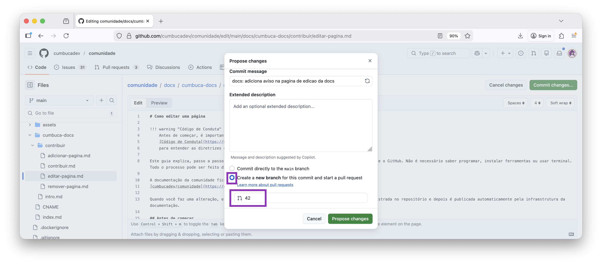

* Depois clique em **Commit changes**.

## Passo 8: abrir o Pull Request

* Depois do commit, o GitHub abrirá automaticamente a página para criar um **Pull Request**.
* Um Pull Request é uma proposta de alteração no repositório.

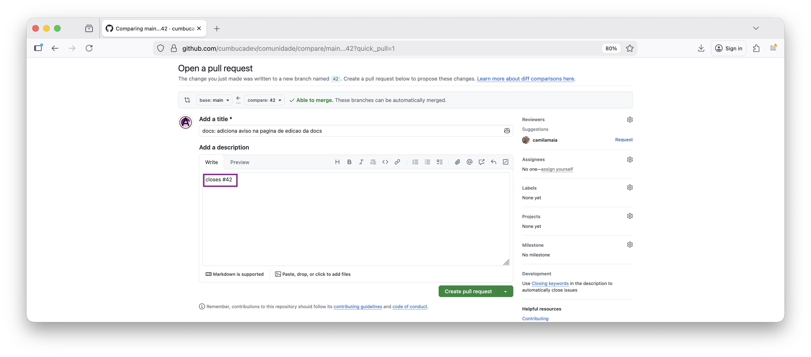

* Revise as mudanças e clique em **Create pull request**.

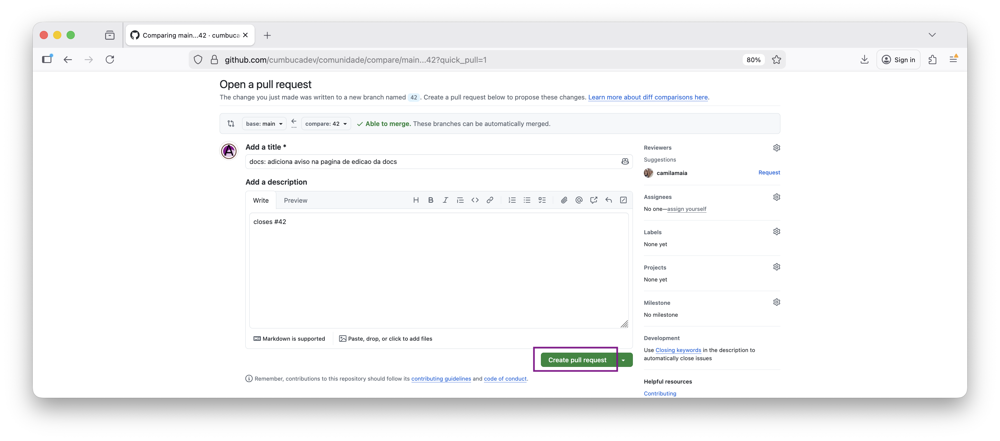

* Depois de clicar em Create pull request, o Pull Request será criado no repositório da comunidade.

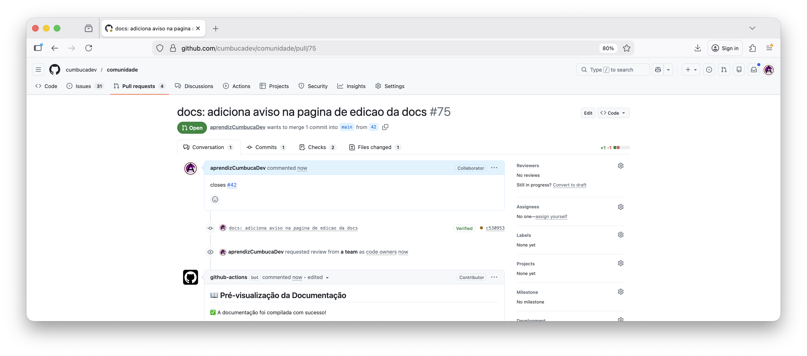

## Passo 9: acompanhar o Pull Request

Depois que o Pull Request é criado, alguém do núcleo responsável irá revisar a nova página.

Durante a revisão podem acontecer algumas situações:

* a página é aprovada
* são sugeridas melhorias
* são solicitados pequenos ajustes

* Se você descer a página do Pull Request, verá um comentário automático com um link para pré-visualizar as mudanças na documentação.

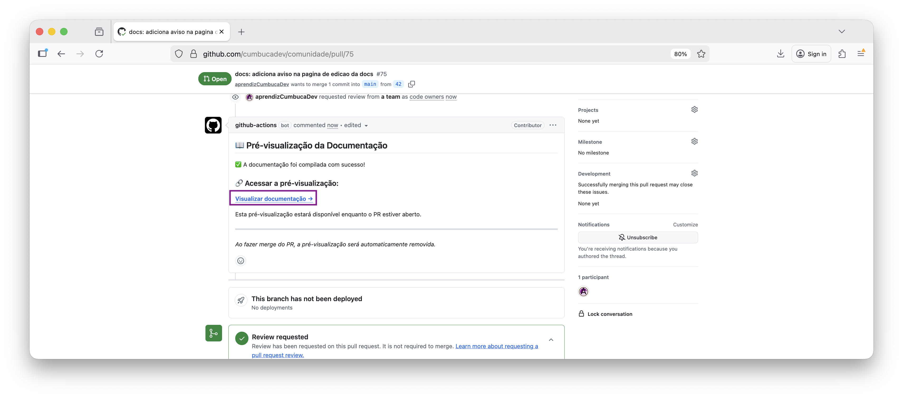

_Caso esse comentário ainda não tenha aparecido ou o link retorne 404, aguarde alguns minutos e atualize a página. O deploy de preview pode levar um pequeno tempo para ser gerado._

## Passo 10: integração do Pull Request

Quando o Pull Request for aprovado - quando estiver tudo verde e o botão `Squash and merge` estiver
habilitado, você deve mesclá-lo. Para isso, simplesmente clique no botão `Squash and merge`.

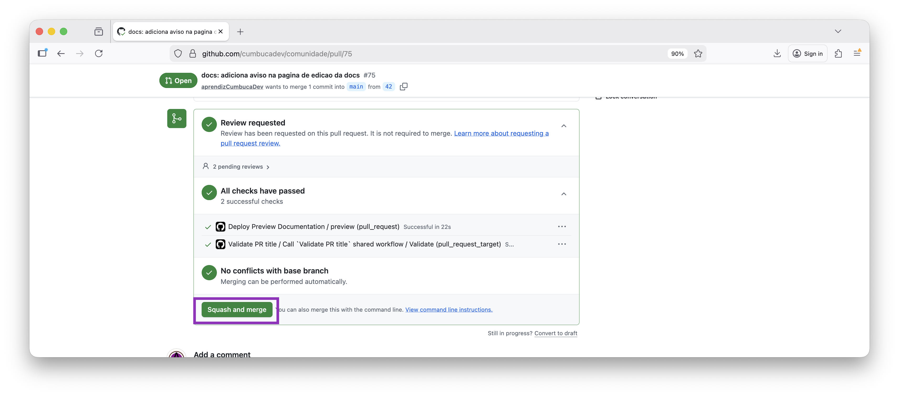

Após a mesclagem, a nova página é integrada ao repositório principal. Em seguida, o site da
Cumbuca Docs será atualizado automaticamente após essa integração.

## Dicas para contribuir com mais facilidade

* Prefira alterações pequenas e claras
* Explique sempre o que foi alterado
* Se tiver dúvida, deixe um comentário no commit
* Não se preocupe em deixar o texto perfeito na primeira versão

Documentação é um processo contínuo. Melhorar aos poucos faz parte da evolução da comunidade.

---

No próximo guia, veremos **como criar uma nova página na documentação e adicioná-la à estrutura da Docs**.
